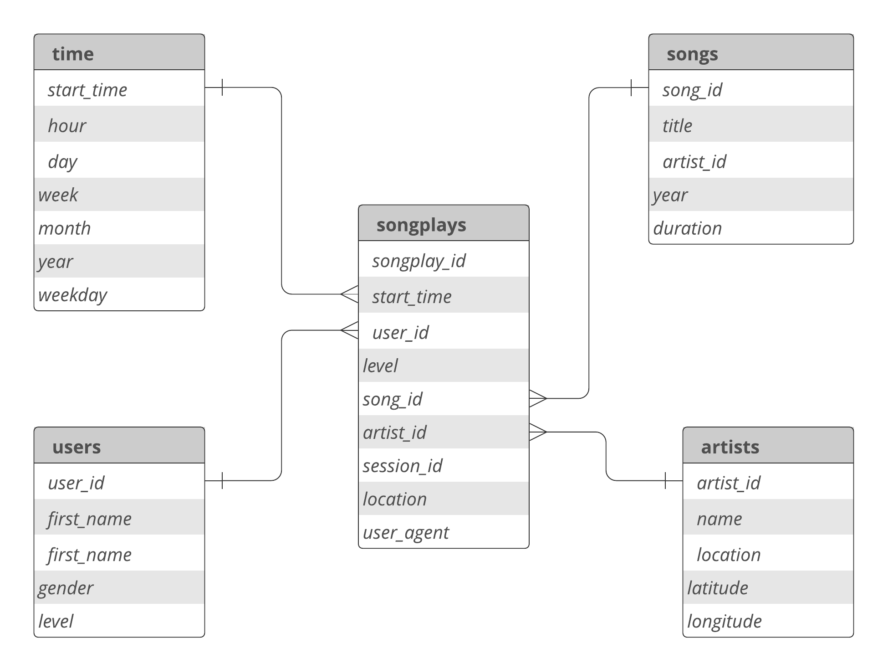
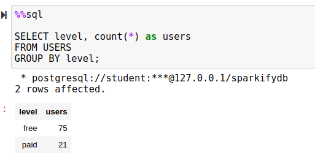
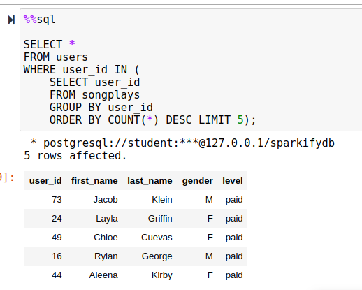

# Data Modeling with Postgres

The scope of the project is to create an analytics database for a music application. The source data are stored in a bunch of JSON files. We process them and extract useful information about users, songs, artists, users' listing information. Next, push extracted data to the database for further analysis. 

## How to Deploy and Run
We have used virtualenv and pip for setting up our Python environment. Setting up the Python environment is fairly easy with virtualenv. You just need to run the following commands to set up the environment.

1. Create a new virtual environment: `virtualenv -p python3.8 venv`
2. Activate it: `source ./venv/bin/activate`
3. Install dependencites: `pip install -r requirements.txt`

Next, execute two following commands to create your database schema and insert data into the fact and dimensional tables. 

1. To create database schema: `python create_tables.py`
2. To load the data into tables: `python etl.py`

## ETL Pipeline
We employed a two-stage approach to building our extract, transform, load (**ETL**) pipeline:
1. First, we used a Jupyter notebook (`etl.ipynb`) to create functions that we need for our ETL process.
2. Next, we transferred that functions to a Python file (`etl.py`).

## Database Structure
Figure 1 shows the start scheme use used for the project. In our database scheme, we have one **fact table** (`songplays`) and four **dimensional tables** (`users`, `songs`, `artists`, `time`).

We are going to run a lot of analytical queries against our data stored in the database. We have selected star schema because it is the most appropriate database schema for our analytical queries. 

 
 <b>Figure 1</b>: The Database Schema

## Some Analytical Queries We are Expected to Run Against Our Database

### Categorize Users Based on Their Tiers

  

### Five Most Active App Users 

  

